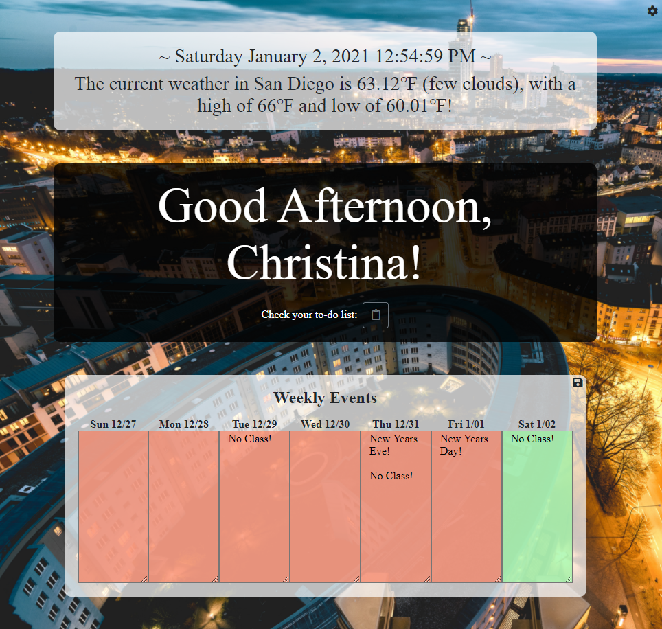

# My Homepage 💻
Updates (as of 1/2/21): Page will load different backgrounds randomly; New to-do list button!
***

 

## Table of Contents
* [Description](#description)
* [Usage](#usage)
* [Questions](#questions)
* [License](#license)

## Description

This is a homepage that a user may set for their browser!  It will display a greeting with their name, as well as the current time and an area for Weekly events!  Within the greeting, there will be an option to open up and modify your to-do list! If the user has an OpenWeather API key, they may also add this to it so that the current weather will display!

Please click [here](https://christina2021.github.io/my-homepage/) to check out this site!

## Usage

⭐When you first start this site, you will be asked for your Name, City, and OpenWeather API Key (if applicable).  The City currently will only be used for OpenWeather, so if you do not have a key, you may leave this section blank at this time as well. 
⭐Once your homepage opens up, you will see a greeting based on the time of day, the time, weather (if applicable), and an area to write notes for the week. 
⭐After you write in some information in the Weekly Events, you will be able to save it by using the save button in this same box. 
⭐Clicking on the clipboard icon in the greeting will open up your to-do list.  You will be able to add/remove to-do list items.  Once you finish modifying your to-do list, click on the "Save Changes" button for it to update.  If you do not want to save your changes or have no changes to add, you may click on the "Close" button instead. 

#### Notes on Usage

⭐If you need to change any information from the start page, you will be able to do so using the settings button in the top-right hand corner of the page. 
⭐Weekly do not automatically save, so make sure to click on the save button! 
⭐Background images will pull up randomly 

## Questions?
Feel free to check out my github profile [here](https://github.com/Christina2021)!
Should you have any questions, you may reach me by e-mail at: <a href="mailto:codechristina2021@gmail.com?subject=Hi,%20Christina!">codechristina2021@gmail.com</a>!.

## License
[MIT](https://choosealicense.com/licenses/mit/#)
